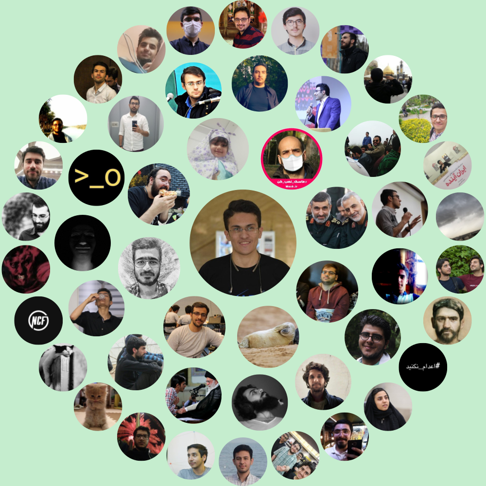

# Twitter Interaction Circle

Originally from [Twopcharts](https://twopcharts.com/) it has been making the round in the dev community.
I believe this is a great opportunity for a project to learn from. 
The concept is easy and straightforward but the realization encompasses a lot of concepts.

You can read more about the realization of this project on the [HackerTyper Blog](https://blog.hackertyper.net/post/twitter-interaction-circles-guide/).

## Installation
```shell script
git clone git@github.com:duiker101/twitter-interaction-circle.git
cd twitter-interaction-circle
yarn install
```

Run with 
```shell script
yarn build
```

You can also generate a text version of the image with the complete list of the presented users with the following command
```shell script
yarn build --text
```
The output will go in `users.txt` file in the root of the project

## Setup
To use the project you will need Twitter API keys. You can get one on the [developer portal](https://developer.twitter.com).

As this project uses only public data, you don't need an authorization key, but you can generate a Bearer Token. This will prevent you from fetching any private data but will grant you slightly higher rate limiting.

More information about Twitter's bearer tokens can be found [here](https://developer.twitter.com/en/docs/basics/authentication/oauth-2-0)

Once you have your consumer keys, rename the `.env.example` file `.env` and put them in there, it should look like this:

```dotenv
CONSUMER_KEY=AAAA
CONSUMER_SECRET=BBBBBB
```

Make sure you don't have spaces.

## Modifications By Me (MohammadHosein)

I added a simple flask app and wsgi interface to communicate with nginx and all needed files to make a service of the project and deplopying it on a server. Also i added a dockerfile. Now, by sending a GET request to server_domain/<username>, server will create given username interaction circle.

## Challenges

You can try to apply the following changes to test your knowledge:
- Apply a shade to  each avatar based on the most common type of interaction
- Render a grid instead of the circles
